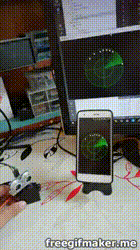

# My-Mini-Radar
building simple radar using ESP8266 and servo motor MG 996R and HC-SR04, and the application is cross platform (windows, android ...).

# Results

https://www.youtube.com/watch?v=iYSFZ4Aru64

# Download ( windows / android ) executable
https://github.com/salim97/My-Digital-Servo-Motor/releases/tag/v1.0

# hardware Setup
in this project i'm using MG996R servo motor and Ultrasound distance HC-SR04

## Wire

| MG996R | ESP8266 |
|--------|---------|
| GND    | GND     |
| 5V     | 5V      |
| PWM    | D7      |

| HC-SR04  | ESP8266 |
|----------|---------|
| GND      | GND     |
| 5V       | 5V      |
| ECHO     | D1      |
| TRIG     | D2      |

See also: https://easyeda.com/benabadji.mohammed.salim/My-Mini-Radar

# Software Setup
you need Qt, you can download it from official site
and then download source code and build it for any platform you are using 

[App Source Code](https://github.com/salim97/My-Digital-Servo-Motor/tree/master/QT_Application/My-Mini-Radar)

# Copyright © 2018-2019

[Benabadji Mohammed Salim](https://github.com/salim97)
